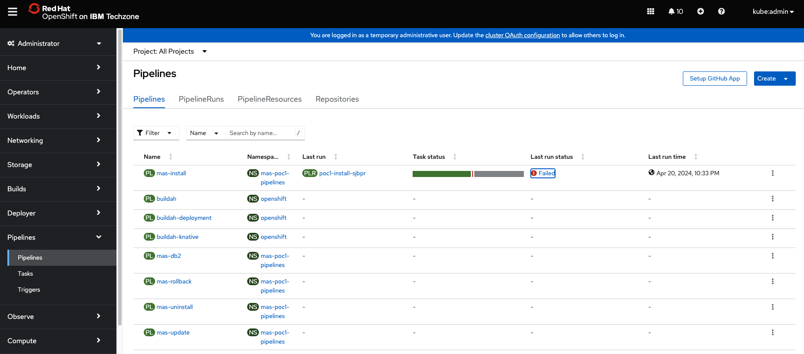
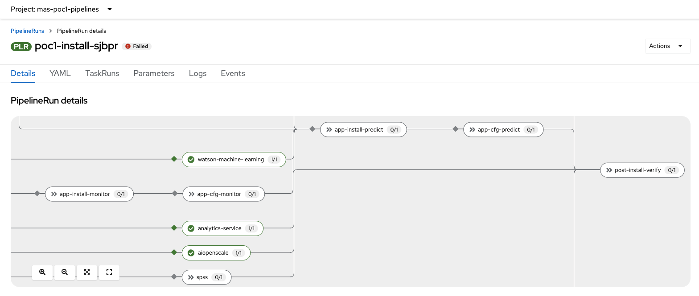
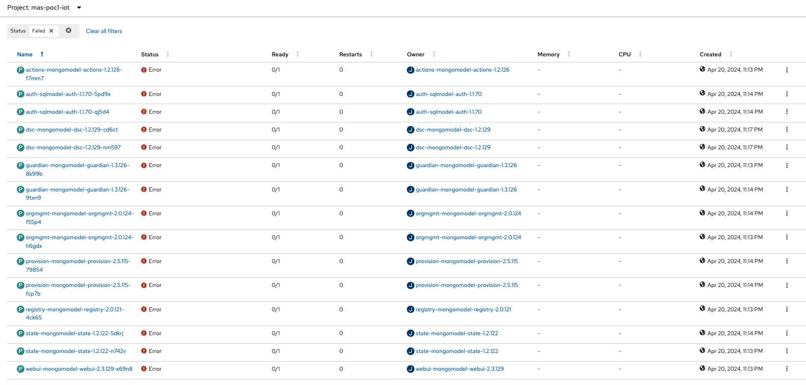

# Deploying IBM Maximo Predict And Troubleshooting Deployment Issues

Maximo Predict is one of the applications in Maximo Application Suite. It can use historical and recent asset performance data to correlate performance factors that predict asset degradation or failure. Other types of data that can be correlated include maintenance records, inspection reports, and environmental data. Maximo Predict uses artificial intelligence to optimize predictive model accuracy.

## Maximo Predict Prerequisites 

Deploying Maximo Predict requires IBM Watson Studio, IBM Watson Machine Learning, Watson OpenScale and Spark. In addition, it requires that Maximo Health and Maximo Monitor, which requires IBM Db2 Warehouse database, Apache Kafka and MongoDB. To meet the prerequisites, you can install Maximo IoT. Alternatively, you can install each application and software components individually.

For more details, check 
- [Deploying IBM Maximo Predict](https://www.ibm.com/docs/en/mas-cd/continuous-delivery?topic=a-maximo-predict)
- [Deploying IBM Maximo Monitor](https://www.ibm.com/docs/en/mas-cd/continuous-delivery?topic=a-maximo-monitor).
- [Deploying IoT tool](https://www.ibm.com/docs/en/mas-cd/continuous-delivery?topic=tool-deploying-iot)
- [Installing Apache Kafka](https://www.ibm.com/docs/en/mas-cd/continuous-delivery?topic=dependencies-installing-apache-kafka)

## Deployment Host or Workstation

You can install MAS locally or in a docker or podman container. The latter is recommended due to its simplicity. 

```
#using docker. You will need to run docker first.
cd masconfig
docker run -it --rm --pull always -v ${PWD}:/masconfig --name ibmmas quay.io/ibmmas/cli

#using podman. You may need to create a virtual environment e.g. on mac.
podman machine init
podman machine start
cd masconfig
podman run -ti --rm --pull always -v ${PWD}:/masconfig quay.io/ibmmas/cli
...
podman machine stop
```

You can run either Ansible Playbooks or the cli command, "mas install". 

To run Ansible playbooks locally, install dependencies such as python3, OpenShift CLI, Ansible collections, and optionally IBM Cloud CLI. Check [MAS Devops Ansible Collection](https://ibm-mas.github.io/ansible-devops/)

To run "mas install" locally, install python3, OpenShift CLI, and optionally IBM Cloud CLI. In addition, [install mas](https://github.com/mas-cli/mas).

## Deploy Maximo Predict on an Existing OpenShift Cluster

Maximo Application Suite is supported on OpenShift 4.12 and, with MAS 8.11 releases, on OpenShift 4.14.

While using Ansible playbooks is an option, you will find it is much easier to work with "mas install", especially for any POC environment with demo data.

After oc login to the OpenShift cluster, run the "mas install" command and complete the steps as follows. 

1. Proceed with the listed cluster
2. Install OpenShift Pipelines Operator
3. IBM Maximo Operator Catalog Selection
```
Enable automatic updates with the online dynamic catalog? [y/N] y
MAS Version:
  1. 8.11
  2. 8.10
Select Subscription Channel > 1
```
4. Accept License Terms
5. Configure MAS Instance. Specify MAS Instance ID e.g. poc1, MAS Workspace ID e.g. masdev, and MAS Workspace Display Name e.g. masdev
6. Configure Operation Mode
```
Operational Mode:
  1. Production Mode (default)
  2. Non-Production Mode

Select Operational Mode > 2
```
7. Configure Domain & Certificate Management. Unless you need to configure the domain and certificates, press Enter ("N" means default value) or type "n".
8. Application Selection. Enter "y" (yes) for Iot, Monitor, Manage, and Predict.
```
Install IoT? [y/N] y
Install Monitor? [y/N] y
Install Manage? [y/N] y
Install Predict? [y/N] y
Install Assist? [y/N] n
Install Optimizer? [y/N] n
Install Visual Inspection? [y/N] n
```
8.1 Configure Maximo Manage. You can specify Manage components and include demo data. Unless you specify an external database, an in-cluster db2 instance will be created.

```
Manage Component Selection
Define which Manage Industry Solutions and Add-ons will be configured in the Manage install.

Provide a comma-separated list of component=version values, as example: 'base=latest,health=latest,civil=latest'

For a complete list of available industry solutions and add-ons that can be installed:
https://ibm-mas.github.io/cli/commands/install/#manage-application-advanced-configuration-optional

 
Customize Manage components? [y/N] y
Manage components to be installed > base latest,health latest
 
Manage Settings - Database
Customise the schema, tablespace, indexspace, and encryption settings used by Manage
 
Customize database settings? [y/N] n
 
Manage Settings - Customization
Provide a customization archive to be used in the Manage build process
 
Include customization archive? [y/N] 
 
Manage Settings - Cognos Analytics
Manage application supports the integration with Cognos Analytics for reporting features which is an optional service installed on top of IBM Cloud Pak for Data. Unless requested these will not be installed.
Once Manage application and Cognos Analytics are installed, you will be able to configure the Manage & Cognos integration following this documentation: https://ibm.biz/BdMuxs
 
Install Cognos Analytics [y/N] 
 
Manage Settings - Other
Other miscellaneous settings for the installation
 
Create demo data? [y/N] y
Configure JMS? [y/N] 
```

8.2 Configure Maximo Predict. Enter 'y' for Watson OpenScale.

```
Predict application supports the integration with IBM SPSS and Watson Openscale which are optional services installed on top of IBM Cloud Pak for Data. Unless requested these will not be installed.
 
Install IBM SPSS Statistics [y/N] 
Install Watson OpenScale [y/N] y
```
9) Configure Databases. You can modify or increase CPU, memory, and database storage capacity.

``` 
9.1) Database configuration for Maximo IoT
Maximo IoT requires a shared system-scope Db2 instance because others application in the suite require access to the same database source.
 - Only IBM Db2 is supported for this database

Create system Db2 instance using the IBM Db2 Universal Operator? [Y/n] 
 
9.2) Database configuration for Maximo Manage
Maximo Manage can be configured to share the system Db2 instance or use it's own dedicated database:
 - Use of a shared instance has a significant footprint reduction but is only recommended for development/test/demo installs
 - In most production systems you will want to use a dedicated database
 - IBM Db2, Oracle Database, & Microsoft SQL Server are all supported database options

Re-use System Db2 instance for Manage application? [Y/n] 
 

9.3) Node Affinity and Tolerations
Note that the same settings are applied to both the IoT and Manage Db2 instances.
Use existing node labels and taints to control scheduling of the Db2 workload in your cluster.
For more information refer to the Red Hat documentation:
- https://docs.openshift.com/container-platform/4.12/nodes/scheduling/nodes-scheduler-node-affinity.html
- https://docs.openshift.com/container-platform/4.12/nodes/scheduling/nodes-scheduler-taints-tolerations.html

Configure node affinity? [y/N] 
Configure node tolerations? [y/N] 
 

9.4) Database CPU & Memory
Note that the same settings are applied to both the IoT and Manage Db2 instances.

    CPU Request:    4000m
    CPU Limit:      6000m
    Memory Request: 8Gi
    Memory Limit:   12Gi

Customize CPU and memory request/limit? [y/N] y
+ CPU Request > 8000m
+ CPU Limit > 10000m
+ Memory Request > 16Gi
+ Memory Limit > 18Gi
 

9.5) Database Storage Capacity
Note that the same settings are applied to both the IoT and Manage Db2 instances.

     - Meta:             20Gi
     - Data:             100Gi
     - Backup:           100Gi
     - Temp:             100Gi
     - Transaction Logs: 100Gi

Customize storage capacity? [y/N] y
+ Data volume size > 300Gi
+ Temporary volume size > 300Gi
+ Metadata volume size > 40Gi
+ Transaction logs volume size > 300Gi
+ Backup volume size > 300Gi
```
10. Configure Kafka. Choose Strimzi as Kafka provider and the listed Kafka version.

```
10.1) Kafka configuration for Maximo IoT
Maximo IoT requires a shared system-scope Kafka instance.
 - Supported Kafka providers: Strimzi, Red Hat AMQ Streams, IBM Cloud Event Streams and AWS MSK.

Create system Kafka instance using one of the supported providers? [Y/n] 
 
Kafka Provider:
  1. Strimzi (opensource)
  2. Red Hat AMQ Streams (requires a separate license)
  3. IBM Cloud Event Streams (paid IBM Cloud service)
  4. AWS MSK (paid AWS service)
 
Select Kafka provider > 1
 
Strimzi: Cluster Version
The version of the Strimzi operator available on your cluster will determine the supported versions of Kafka that can be deployed.
 - If you are using the latest available operator catalog then the default version below can be accepted
 - If you are using older operator catalogs (e.g. in a disconnected install) you should confirm the supported versions in your OperatorHub

Kafka version > 3.7.0
```
11. Choose 'n' for steps 11 through 14.

```
11) Configure Turbonomic
The IBM Turbonomic hybrid cloud cost optimization platform allows you to eliminate this guesswork with solutions that save time and optimize costs.
 - Learn more: https://www.ibm.com/products/turbonomic

Configure IBM Turbonomic integration? [y/N] 
 

12) Additional Configuration
Additional resource definitions can be applied to the OpenShift Cluster during the MAS configuration step.
The primary purpose of this is to apply configuration for Maximo Application Suite itself, but you can use this to deploy ANY additional resource into your cluster.

Use additional configurations? [y/N] 
 

13) Configure Storage Class Usage
Maximo Application Suite and it's dependencies require storage classes that support ReadWriteOnce (RWO) and ReadWriteMany (RWX) access modes:
  - ReadWriteOnce volumes can be mounted as read-write by multiple pods on a single node.
  - ReadWriteMany volumes can be mounted as read-write by multiple pods across many nodes.

Storage provider auto-detected: OpenShift Container Storage
  - Storage class (ReadWriteOnce): ocs-storagecluster-ceph-rbd
  - Storage class (ReadWriteMany): ocs-storagecluster-cephfs
 
Choose your own storage classes anyway? [y/N] 
 

14) Advanced Settings
Customize cluster monitoring storage settings, ingress certificate secret, workload scaling profile and default namespaces for MAS dependencies.

Configure Advanced Settings? [y/N] 
```
15. Configure IBM Container Registry
```
Re-use saved IBM Entitlement Key? [Y/n] n
IBM Entitlement Key >  *********************************************
```

16. Configure Product License. Specify the directory and license file name, e.g. "/masconfig/license.dat".
```
License File > /masconfig/license.dat
``` 

17. Configure UDS. Specify email and contact name.
```
UDS Contact Email > xxx@xxx.com
UDS Contact First Name > xxx
UDS Contact Last Name > xxx
```

Review and preceed with the settings. 

```
Non-Interactive Install Command
Use these commands to easily re-run the same installation anywhere:

export IBM_ENTITLEMENT_KEY=xxx
mas install --mas-catalog-version v8-amd64 --accept-license \
  --license-file /masconfig/license.dat \
  --uds-email 'xxx@xxx.com' --uds-firstname 'xxx' --uds-lastname 'xxx' \
  --storage-rwo 'ocs-storagecluster-ceph-rbd' --storage-rwx 'ocs-storagecluster-cephfs' --storage-pipeline 'ocs-storagecluster-cephfs' --storage-accessmode 'ReadWriteMany' \
  --mas-instance-id 'poc1' --mas-workspace-id 'masdev' --mas-workspace-name 'masdev' \
  --mas-channel '8.11.x' --non-prod \
  --iot-channel 8.8.x \
  --monitor-channel 8.11.x \
  --manage-channel 8.7.x \
  --manage-jdbc system --manage-components base latest, health latest --manage-demodata \
  --predict-channel 8.9.x \
  --kafka-provider strimzi --kafka-version 3.7.0 \
  --db2u-channel v110508.0 --db2u-system \
  --db2u-cpu-request 8000m --db2u-cpu-limit 10000m --db2u-memory-request 16Gi --db2u-memory-limit 18Gi \
  --db2u-backup-storage 300Gi --db2u-data-storage 300Gi --db2u-logs-storage 300Gi --db2u-meta-storage 40Gi --db2u-temp-storage 300Gi
```

20. Launch Installation. You can view progress at the provided url e.g. 
  https://xxx.com/pipelines/ns/mas-poc1-pipelines

## Add Maximo Predict to an Existing MAS Manage Environment

There are three options to deploy Maximo Predict to an existing MAS Manage environment.
- Ansible playooks
- mas install
- MAS admin console

The first two options require that you identify the several values first that are specific to the environment in addition to common values such as entitlement key, and license file. Below are some of the values you will need to know.

- The MAS instance ID and workspace ID, which you can find from the "ManageWorkspace" instance in custom resources. 
- External certificates if used. You can find them in the Certificates section from the MAS admin portal. Also, you can find them on the MAS core networking route page from the OpenShift admin portal. Note that the two certificates in "Certificate" in OpenShift are mapped to the tls.crt in MAS, the CA certificate maps to ca.crt, and the Key maps to tls.key. When Maximo Predict is deployed, you will see five certificate entries for suite core services, Manage, IoT, Monitor, and Predict.

The third option is to work with the MAS admin console, which has been most successful based on my limited experience. It is therefore discussed here.

Check if Manage with Health is enabled. If not, enable it from the MAS admin console.

The entire Maximo Predict deployment and activation process, including all required applications, can take 4-6 hours or longer.

### Install Kafka

You can find details on [Installing Apache Kafka](https://www.ibm.com/docs/en/mas-cd/continuous-delivery?topic=dependencies-installing-apache-kafka).

Step 7 is to create a Kafka instance using yaml. The specified version 2.7 is outdated. But even if you change it to the compatible versions like 3.5 or 3.6, it still shows some errors and as a result the pod is not ready. 

You can create the Kafka instance from the AMQ Stream operator. Complete the form with the values specified in the yaml file and create it. Review the yaml file and fix any missing or incorrect values.

Step 10 is to create a Kafka user. The yaml file works but you may notice some warning messages.

```
In resource KafkaUser(kafka/maskafkauser) in API version kafka.strimzi.io/v1beta2 the operation property at path spec.authorization.acls.operation has been deprecated, and should now be configured using spec.authorization.acls[*].operations.

Resource KafkaUser(kafka/maskafkauser) contains object at path spec.authorization.acls.resource with unknown properties: name, patternType
```
Make a note of the Kafka host and port, username, password and the certificate. You'll need them when configuring Kafka for IoT deployment.

### Install IoT

Before deploying IoT, you will need to configure Kafka from the MAS admin console. Enter the Kafka host and port (443), username, password, and the certificate. Wait until the connection to the Kafka instance is validated.

Click the advanced settings to change:
- Storage: size 100Gi, storage class e.g. "ocs-storagecluster-ceph-rbd" 
- Deployment: small

If external certificates are used, configure the setting on the MAS admin console.

If the deployment gets stuck, you can troubleshoot pods in the IoT namespace. Alternatively, you can delete the IoT tool from the MAS admin console and re-install it.

You may notice many pods have errors during deployment, but the deployment will finish. The pods with errors can be addressed later.

More details on [Deploying IoT tool](https://www.ibm.com/docs/en/mas-cd/continuous-delivery?topic=tool-deploying-iot).

### Deploy Maximo Monitor

While it is possible to run the Ansible playbook to install Maximo Monitor, it is much easier to deploy it from the MAS console. 

If external certificates are used, configure the setting on the MAS admin console.

For more details, check [Deploying IBM Maximo Monitor](https://www.ibm.com/docs/en/mas-cd/continuous-delivery?topic=a-maximo-monitor).

### Deploy Maximo Predict

While it is possible to run the Ansible playbook to install Maximo Predict, it is much easier to deploy it from the MAS console. 

If external certificates are used, configure the setting on the MAS admin console.

Also, configure Watson Studio by providing the url, admin username, and password. Wait until the connection is validated. 

If Watson Studio is not available, deploy CP4D on the same OpenShift cluster or on a separate one. For more details check [Installing IBM Cloud Pak for Data](https://www.ibm.com/docs/en/cloud-paks/cp-data/4.8.x?topic=installing).

For more details, check [Deploying IBM Maximo Predict](https://www.ibm.com/docs/en/mas-cd/continuous-delivery?topic=a-maximo-predict). Also, you may use the opensource tool, [Cloud Pak Deployer](https://ibm.github.io/cloud-pak-deployer/30-reference/process/overview/) available on github.

Note that you will deploy Maximo Predict first and then activate it.

## Troubleshooting Maxim Predict Deployment Issues

Deploying Maximo Predict on an existing OpenShift cluster can take a few hours, depending on selected options. From the OpenShift admin console, you can check the deployment status by reviewing the pipelines.



Click the last run button (or link) of the "mas-install" pipeline to view the details of the task runs.



If the pipeline stops with errors, you can re-run the pipeline. Alternatively, you can complete the failed tasks from the OpenShift console and the MAS console. However, it is not guaranteed that either option can fix all issues.

1. IoT Pod Errors

If IoT appears active in MAS workspace, but some IoT pods are in errors, you can proceed with Monitor and Predict deployment and fix the errors later.



2. Activate MAS Manage from MAS Admin Console

If Manage activation failed, you can re-activate it by taking the following steps.

- From the MAS admin console, deactivate Manage from the Actions menu.
- From the OpenShift admin console, search "manageworkspace" in custom resources. Select ManageWorkspace, and click on the Instances tab. Click on the instance, e.g. "poc1-masdev", delete the instance from the Actions menu. Open the yaml of the instance in terminating state, find the finalizer lines as shown and delete them. Save the yaml file. The instance should be gone now. The Manage activation should be stopped now.
```
  finalizers:
    - manageworkspace.apps.mas.ibm.com/finalizer
```
- From the MAS admin console, select Manage in the workspace. Select "Update configuration" from the Actions menu. Edit database connection. 
a. Ensure Health is checked in the Components list.
b. Click "Show advanced settings". Switch off "System managed" on database. Enter "maximo" in the Schema box, "maxdata" in the table space and index space. Check "Install demo data", and deselect "DB2 Vargraphic".
c. Apply the changes and activate Manage.

This step can take more than 2 hours. When done, MAS Manage will active in the MAS workspace.

## Acknowledgement

Many thanks to my colleagues, David Boggs and JANKI VORA for their assistance and support.
